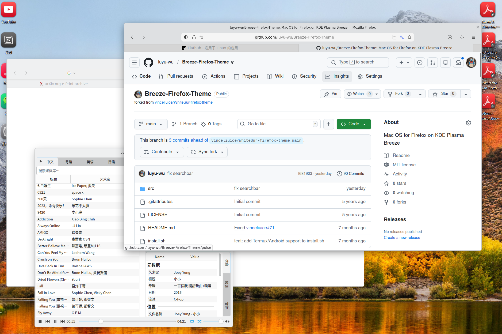

## <p align="center">Breeze Safari Theme for KDE Plasma</p>



Based on https://github.com/vinceliuice/WhiteSur-firefox-theme

## Installation
Run the following commands in the terminal:

```sh
./install.sh
```

INFO: Do not run it with sudo, or it will install in root user folder !

Usage:  `./install.sh`  **[OPTIONS...]**
